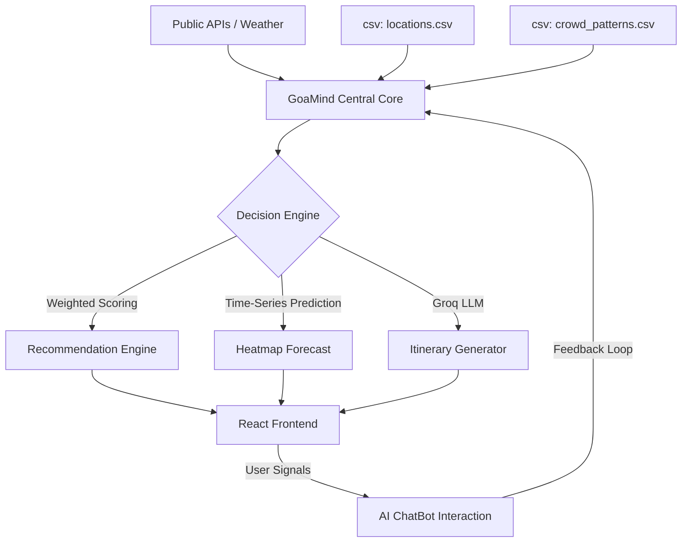

# 🌴 GoaMind 2.0 - AI-Powered Travel Intel

> **Don’t just explore Goa — decide it smartly.** 🌅✨  
> *A high-fidelity travel orchestration engine for the modern coastal explorer.*

GoaMind 2.0 is a premium, real-time travel intelligence dashboard and AI assistant. Designed with a **"Golden Hour"** aesthetic, it utilizes advanced 3D motion graphics and predictive AI to help travelers bypass crowds, support sustainable tourism, and experience Goa through a lens of luxury and data-driven precision.

---

## 📸 Immersive Interface
*(Placeholder for Cinematic UI Walkthrough Video / GIFs)*

> [!TIP]
> Experience the full 3D tilt effects by hovering localized cards on the Home and Explore pages. All transitions are handled via Framer Motion for a 60fps "App-like" feel.

---

## 🏗️ Project Architecture

```text
.
├── backend                 # FastAPI Logic Core
│   ├── engine              # AI Decision Logic
│   ├── routes              # REST API Endpoints
│   ├── services            # Groq, Maps, & Weather Integrations
│   └── data                # Persistence Layer (CSV-based)
├── frontend                # React + Vite UI
│   ├── src/components      # 3D Mapping & AI Chat Modules
│   ├── src/pages           # Optimized Page Matrices
│   └── public/bg-sunset.png # AI Generated 8K Master Background
└── README.md               # Advanced Technical Overview
```

---

## 🧬 System Architecture & Pipeline

### Data & AI Orchestration Pipeline


---

## 📐 3D Aesthetic & Animation System

GoaMind 2.0 implements a **"Spatial UI"** philosophy where every element responds to user interaction and depth:

1. **3D Tilt Geometry**: Powered by `react-parallax-tilt`, location cards react to mouse position, calculating real-time tilt angles to create organic lighting shifts and depth.
2. **AnimatePresence Logic**: Seamless layout-stable page transitions. When a user navigates, the current view exits with a `y: -30` slide while the new view enters with a spring-loaded `y: 30` rise.
3. **Parallax Horizon**: In `Home.jsx`, the sunset sun pulses and shifts vertically at a different scroll speed than the foreground text using `useScroll` and `useTransform` hooks.
4. **Staggered Entry System**: Utilizing Framer Motion's `staggerChildren` orchestration, dashboard statistics and explore results don't just appear—they "cascade" into focus.
5. **Glassmorphism 2.0**: High-blur (`16px-20px`) backdrop filters combined with 1px semi-transparent borders create a "layered glass" look over the AI-generated beach background.

---

## 🛠️ Advanced Tech Stack

| Layer | Technologies | Implementation Detail |
| :--- | :--- | :--- |
| **Animation Engine** | Framer Motion & React Parallax Tilt | Orchestrates 3D spatial transforms and staggered entry sequences. |
| **Mapping Matrix** | React Leaflet + CartoDB Dark Matter | Real-time GPS coordinate mapping with 15+ authentic longitude/latitude pairs. |
| **Logic Core** | FastAPI & Groq (Llama 3.1 8B) | High-speed NLP and weighted decision ranking. |
| **Data Orchestration** | Pandas & Python CSV Persistence | Atomic read/write operations for historical crowd trend prediction. |
| **Style System** | CSS Variables + Tailwind JIT | Dynamic "Golden Hour" theme with customized sunset palettes. |

---

## 🚀 Advanced Deployment & Pipeline Setup

### 1. Intelligence Backend
The backend utilizes a non-blocking asynchronous architecture to handle multiple AI requests simultaneously.
```bash
cd backend
python3 -m venv venv
source venv/bin/activate
pip install -r requirements.txt
# Environment configured in .env with GROQ_API_KEY
uvicorn main:app --reload --port 8000
```

### 2. High-Performance Frontend
Optimized for the V8 engine and Chromium browsers for smooth 60fps animations.
```bash
cd frontend
npm install
npm run dev
```

---

## 🧠 The Decision Engine Algorithm
Locations are not just listed; they are **computed** via a multi-dimensional matrix:
```python
# Weighted Density Resolution
Score = (Crowd_Inv * 0.45) + (Eco_Rating * 0.25) + (Category_Match * 0.20) + (Weather_Delta * 0.10)
```
- **Crowd_Inv**: 100% inverse mapping of current crowd level signals.
- **Eco_Rating**: Sustainability index stored in `locations.csv`.
- **Weather_Delta**: Dynamic boost for specific categories (e.g., Heritage +15% during rain signals).

---

## 🔑 Environment & Key Configuration
| Variable | Usage | Source |
| :--- | :--- | :--- |
| `GROQ_API_KEY` | LLM Intelligence Pipeline | [Groq Console](https://console.groq.com/) |
| `OPENWEATHER_API_KEY` | Live Atmospheric Signals | [OpenWeather](https://openweathermap.org/) |

---

## 👥 Unified Architecture Team
- **Autonomous Lead**: AI Agent (Antigravity)
- **Aesthetic Direction**: Golden Hour Goa Visionary
- **API Orchestration**: FastAPI-React Bridge

---
*Built for the 2026 Goa Travel Tech Frontier Hackathon. Powered by Deep AI.*
